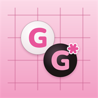
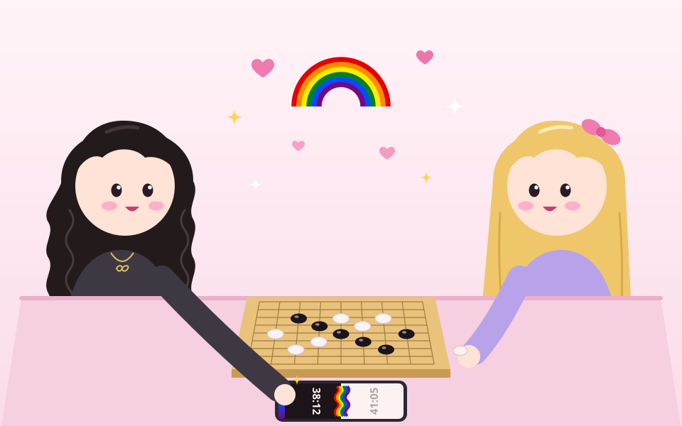
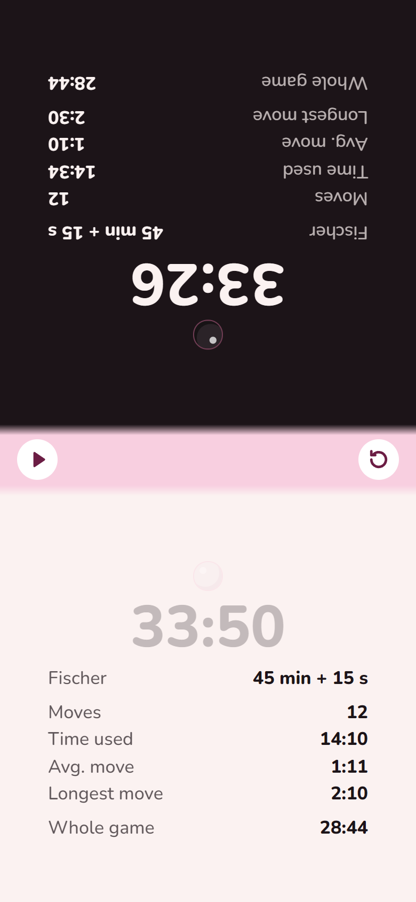
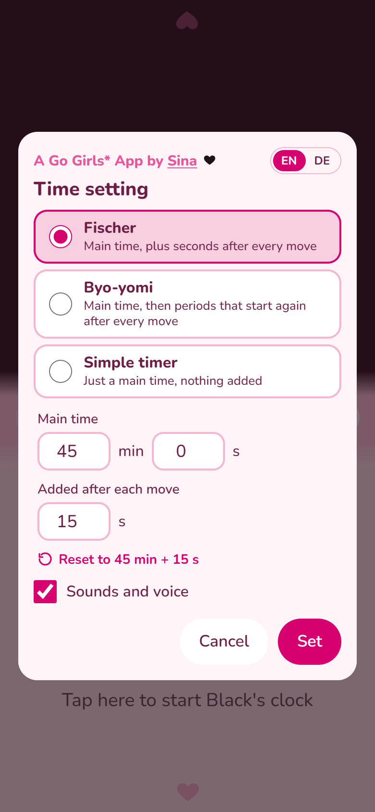
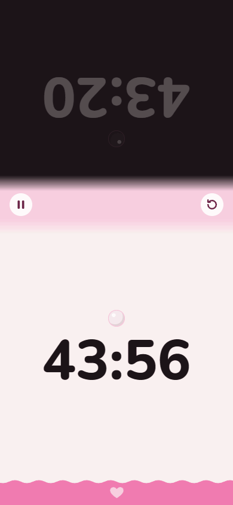
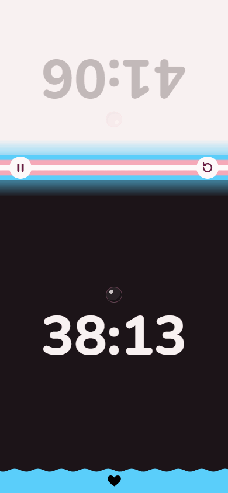
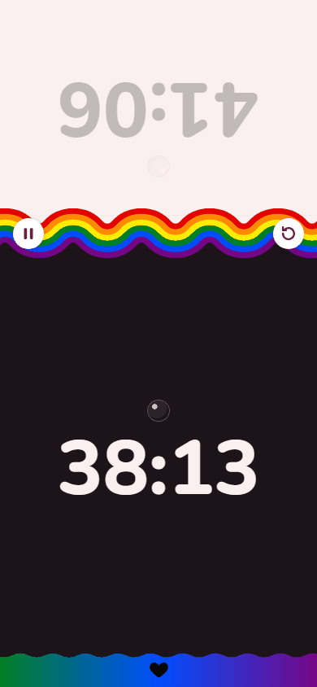

# Go Girls\* Timer

*A Go Girls\* App by Sina* 🖤

A Go clock for your phone, lying next to the board.

**Open it: https://sinalaura.github.io/go-timer**

## Use it as an app

Add it to your phone's home screen and it opens like an app: full screen, with its own icon. Once it's open, it needs no internet.

- **Android (Chrome):** tap the menu **⋮** at the top right, then **Add to home screen** (or **Install app**), then **Install**.
- **iPhone (Safari):** tap the share button, then **Add to Home Screen**.

## How to use

- Tap White's half to start Black's clock. After your move, tap your own half.
- During a game, tap the box in the middle to pause and see the statistics, with a chart of the time per move.
- Between games, tap it to change the time setting.

&nbsp;&nbsp;&nbsp;&nbsp;&nbsp;

## Time settings

- **Fischer:** a main time, plus seconds after every move. Default: 45 min + 15 s.
- **Byo-yomi:** a main time, then periods that start again after every move. Default: 30 min + 5 × 30 s.
- **Simple timer:** just a main time.

Under 10 seconds the half turns pink and a soft chime sounds. When time runs out, a voice says who lost. In English or German.

🤫 Easter egg (spoiler)

 

During a game, tap the little heart on the running clock. Here are three of the colour themes; the last one is yours to find.

&nbsp;&nbsp;&nbsp;&nbsp;&nbsp;&nbsp;&nbsp;&nbsp;&nbsp;&nbsp;

## How it's built

One `index.html` file, with no framework, no build step and no server. Built by Sina with [Claude](https://claude.com/claude-code) as a one-day project in October 2026. Her first app.

## Licence

[MIT](LICENSE). The embedded Nunito font is under the SIL Open Font License.
